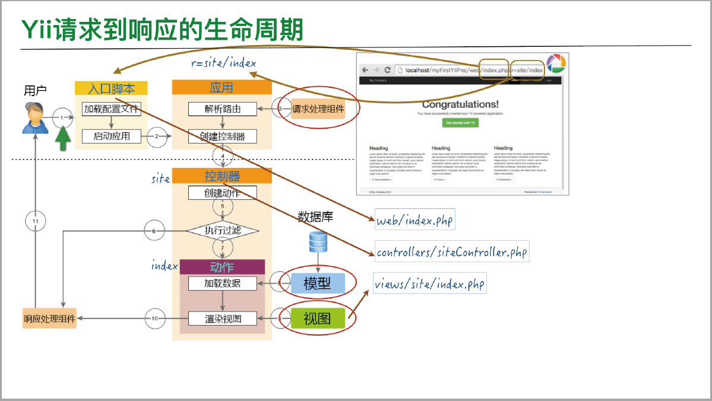
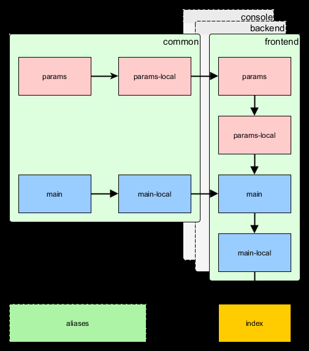
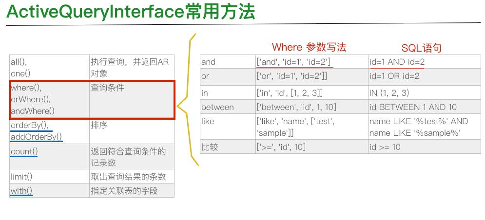
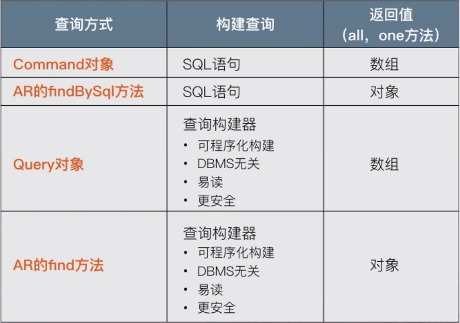
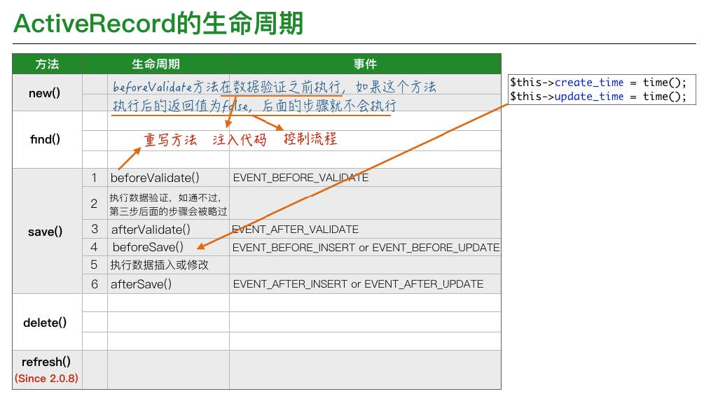
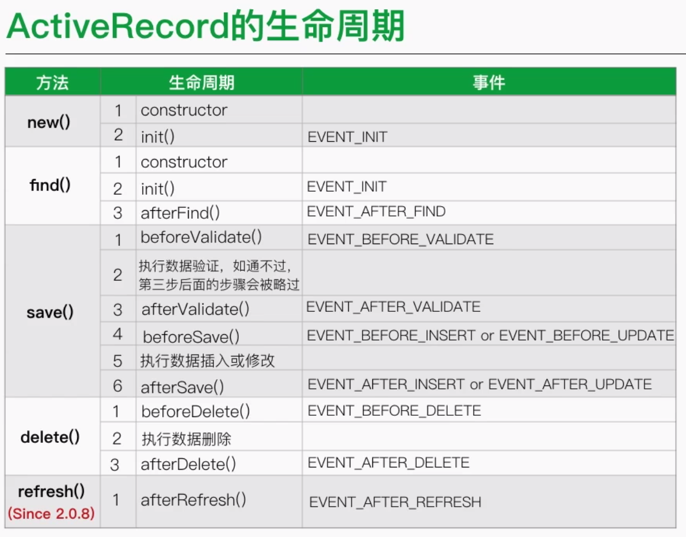
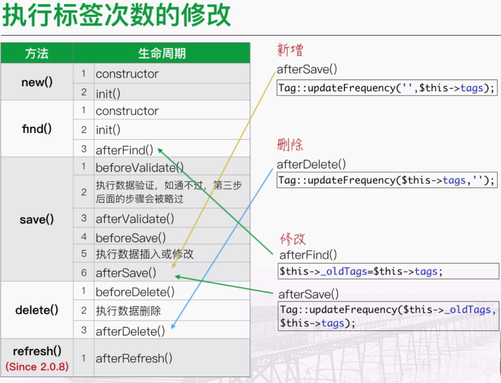

# YiiBlog #
### 这是使用yii2框架创建的示例博客。 ###

本项目共分三个部分：  
1. 前台   
1. 后台   
1. API    

# Basic模板的安装 # 

### 安装方式 ###
- composer
- 归档文件
	修改cookie的验证字符串 main-local.php
 
### 目录结构 ###

	controllers 控制器类
	models 模型类
	views  视图类
	commonds 控制台命令类
	tests 测试相关文件
	assets 资源文件
	config 应用配置文件夹
	web 应用根目录
		assets 资源文件
		index.php 应用入口文件
	runtime 运行时生成的日志或缓存文件 
	vender  yii框架自身以及第三方扩展
	yii yii框架控制台命令

yii请求到响应的生命周期

这幅图分成分下两部分来看

1. 发出url后，Apache会执行index.php文件，在yii框架中，这个叫入口文件。
这个文件在web目录下 ，执行入口文件主要两件事
	- 读取配置文件
	- 用配置文件的数据来实例化一个应用主体

1. 应用主体接下来要进行路由解析，路由解析就是根据url中的参数r,来决定由哪些代码来完成用户的请求，这一步先获取r的值。

1. 在请求组件的帮助下，请求路由，解析出路由。比如创建出一个SiteController的控制器实例，并且执行里面的actionIndex方法

1. 这一步开始，程序的执行就交到了控制器手中，在这一步，创建好一个actionIndex的动作。

1. 执行过滤。执行过滤是判断是否具备执行动作的条件，比如用户有没有权限，数据是不是post提交的等待。如果条件不允许，则放弃执行的而动作，取到第六步，然后执行警告，并反馈给用户。
如果条件允许，则执行第七步。

1.  通过模型拿到数据

1. 用视图模板，结合模型提供的数据，渲染出一个视图。

1. 接下来把渲染出来的视图，经过响应处理组件协助，生成漂亮的页面，响应给用户。

### 入口文件 ###

- 定义全局常量
- 注册composer自动加载器
- 包含yii类文件
- 加载应用配置
- 创建一个应用实例并配置
- 调用yii\base\Application::run()来处理请求

### 应用主体 ###
- 是yii\web\Application类的实例
- 是管理yii应用系统整体结构和生命周期的对象
- 每个入口脚本只能创建一个应用主体
- 可以通过\Yii::$app来访问

### 控制器 ###
- 继承自yii\base\Controller类，负责处理请求和响应。
- action开头的方法 ，是动作
- behavior方法则执行过滤。

### 视图 ###

- 视图是MVC模式中View这一部分
- 视图在yii\web\View应用组件的帮助下构造和渲染完成，应用组件构造和渲染的依据是视图模板文件
- 视图模板文件有html和php组成
- 视图中的$this 指向yii\web\View来管理和渲染这个视图文件
- 控制器渲染视图文件默认在@app/views/ControllerId目录下

### 布局 ###

- 布局是一种特殊的视图，代表多个视图的公共部分。
- 布局也是视图，它可像普通视图一样创建，默认保存在@app/views/layouts/里面
- $content是控制器渲染出来的结果
- 默认使用@app/views/layouts/main.php布局文件，变换布局时，直接在action方法中指定布局文件 public $layout='post'

### 应用主体补充 ###

- 使用Yii::$app访问应用主体
- 在web.php中配置
Yii::$app->user->identity->username
Yii::$app->HomeUrl
Yii::charset
Yii::language

在web.php中

- id  区分其他应用的唯一标识
- basePath 指定应用的根目录
- aliases 用一个数据定义多个别名
- components这是最重要的属性，注册多个应组件
- defaultRoute 缺省路由规则

## 模型 ##

	 public function actionContact()
	    {
	        $model = new ContactForm();
	        if ($model->load(Yii::$app->request->post()) && $model->validate()) {
	            if ($model->sendEmail(Yii::$app->params['adminEmail'])) {
	                Yii::$app->session->setFlash('success', '感谢您联系我们，我们会尽快回复您');
	            } else {
	                Yii::$app->session->setFlash('error', '您发送的信息有误');
	            }
	
	            return $this->refresh();
	        } else {
	            return $this->render('contact', [
	                'model' => $model,
	            ]);
	        }
	    }

以上面代码为例，研究模型

1. 第一句，实例化一个ContactForm这个类对象，命名为$model
2. 判断，调用model对象的load方法，这个方法是把用户提交的数据，赋值给model，看看这个对象是否成功执行，并且判断是否成功执行了model的contact方法
3.  如果都成功，会给用户发送邮件，并且页面显示成信息
4.  如果失败，则返回失败信息

- ContactForm类是一个表单模型类，可以通过继承yii\base\Model或者它的子类(Active Record)实现更多特性
- 模型类可以像普通类一样定义和访问
- 块赋值 
- 模型类中的rules方法来实现验证，可调用yii\base\Model::validate()来验证收到的数据

## 表单 ##

- yii\wedgets\ActiveForm 类来创建表单
- ActiveForm::begin()不仅创建了一个表单，同时标志的表单的开始
- 生成的表单的name为模型类名[name],比如ContactForm[email]
- 通过调用Active::field()方法来创建一个activeField实例，这个实例会创建表单的input标签，以及对应的js验证

	<?php $form = ActiveForm::begin(['id' => 'contact-form']); ?>
	    <?= $form->field($model, 'name')->textInput(['autofocus' => true]) ?>
	    <?= $form->field($model, 'email') ?>
	    <?= $form->field($model, 'subject') ?>
	    <?= $form->field($model, 'body')->textarea(['rows' => 6]) ?>
	    <?= $form->field($model, 'verifyCode')->widget(Captcha::className(), [
	        'template' => '

{image}

{input}

',
	    ]) ?>
	    

	        <?= Html::submitButton('提交', ['class' => 'btn btn-primary', 'name' => 'contact-button']) ?>
	    

	<?php ActiveForm::end(); ?>

- 一些额外的标签，可以使用HTML助手类来书写
 		<?= Html::submitButton('提交', ['class' => 'btn btn-primary', 'name' => 'contact-button']) ?>

- 关于块赋值，表单生成的input的name,实际是以对象名来命名的一个数组，数组的键和模型的属性对应，提交过来的数据对应键的值，模型里面load方法实际就是执行下面这样一句赋值  
		$model->name=isset($data['name']) ? $data['nbame'] :null;

# 创建博客原型 #

yii配置文件加载顺序

## Gii使用 ##

- Gii是一个基于web的代码生成器，用来生成模型，控制器，表单，增删改查等这些功能更的代码，Gii也叫脚手架程序，是一种辅助工具
- 在main-local.php里面，配置开启Gii，开发模式下，是开启的。
- 在浏览器中，通过r=gii这个参数来访问Gii

## Gii生成模型类 ##
- 在Gii界面的模型上点击start按钮，填写数据库表名，比如post
- 模型类的类名比如Post
- 命名空间 common\models
- 其他默认，点击生成，就生成了Post.php和这个模型类文件
-  生成的模型类文件包含tableName,rules,attributeLabels,以及一些表连接方法

## Gii针对模型类生成增删改查功能 ##
- 模型类名 common\models\Post
- 搜索类名 common\models\PostSearch
- 控制器类 backend\controllers\PostController
- 视图模板文件存放目录 @app/views/post
- 点击生成，生成控制器类，搜索类以及视图模板文件

# 后台完善Post部分 #

## yii使用数据库 ##
- yii通过数据库访问对象（DataBase Access Objects 简称DAO）来使用数据库。DAO是建立在PDO之上的，一套面向对象的方式来访问数据库的API

- 在main.php中配置db,这是就会创建一个yii\db\Connection对象，并用这个对象来访问数据库，这个对象写法Yii::$app->db

- 使用yii\db\Command访问数据库
		$post=Yii::$app->db->createCommand('select * FROM post')->queryAll();
	或者绑定条件参数
		$post=Yii::$app->db->createCommand("SELECT * FROM post WHERE id=:id AND status=:status")
		    ->bindValue(':id',$_GET['id'])
		    ->bindValue(':status',2)
		    ->queryOne();
- 使用yii\db\command访问数据库优缺点
  - 优点
    1. 简单，只需要处理sql语句和数据即可
    2. 高效，通过sql语句查询非常高效
  - 缺点
    1. 不同数据库sql语句可能不同
    2. 用数组，而没有用到面向对象的方式来管理数据，代码难以维护
    3. 会有SQL注入的不安全因素存在

## ActiveRecord ##
Active Record活动记录，简称AR，提供了一种面向对象的接口，用于访问数据库中的数据

- 一个AR类关联一张数据表，每个AR对象对应表中一行 

- AR对象的属性，对应为数据行的列

- 可以直接以面向对象的方式来操纵数据表中的数据

### 声明一个AR类 ###

- 从yii\db\ActiveRecord基类继承，并实现tableName方法
- 一个完整的AR类还包括属性标签，数据规则，业务代码等内容

### AR类查询数据 ###

AR类提供了两个静态方法来构建DB查询，并且把查询到的数据填充到AR对象实例里，最后返回这个对象

这两个方法，一个是find,一个是findBySql

	yii\bd\ActiveRecord::find()
	yii\bd\ActiveRecord::findBySql()

比如 

- find
		$model=Post::find()->where(['id'=>32])->one();
		$model=Post::find()->where(['status'=>1])->all();
- findBysql
		$sql="SELECT * FROM post WHERE status=1";
		$model=Post::findBySql($sql)->all();

关于find

	$model=Post::findOne(1);
	$model=Post::findAll(['status'=>1]);

find方法是通过创建一个ActivQueryInterface实例对象来实现的

### ActivQueryInterface 常用方法###

	$model=Post::find()->where(
	    	[
	    		'AND',
			    ['status'=>1],
			    ['author_id'=>1],
			    ['LIKE','title','yii2']
		    ]
	    )
		->orderBy('id')->all();

### ActiveRecord访问数据列 ###

	    $model=Post::findOne(32);
	    echo $model->title;
	    echo $model->author_id;

### ActiveRecord操作数据 ###

- Create
		$post=new Post();
		$post->title='title';
		$post->tags='tag';
		$post->save();
- Update
		$post=Post::findOne(32);
		$post->status='active';
		$post->save();
- READ
		$post=Post::findOne(32);
- Delete
		$post=Post::findOne(32);
		$post->delete();

## 数据小部件 ##

数据小部件，用来显示数据的小模块，常用部件
- DetailView 用来显示一条记录数据的详细情况
- ListView
- GridView
- listView和GridView可以用来显示一个拥有分页，排序和过滤功能的一组数据

### DetailView ###
DetailView小部件常用来显示一条记录的详情
- 一个model模型类的对象
- 一个AR类的实例对象
- 由键值对构成的一个关联数组
在backend/views/post/view.php中

	/* @var $this yii\web\View */
	/* @var $model common\models\Post */

	DetailView::widget([
	        'model' => $model,
	        'attributes' => [
	            'id',
	            'title',
	            'content:ntext',
	            'tags:ntext',
	//            'status',
	            ['label'=>'状态',
	              'value'=>$model->status0->name
	            ],
	            'create_time:datetime',
	            'update_time:datetime',
	//            'author_id',
	            ['label'=>'作者',
	                'value'=>$model->author->nickname
	            ]
	        ],
	    ])

$model指的是 common\models\Post
$model->status0的来源如下

	public function getStatus0(){
	    return $this->hasOne(Poststatus::class,['id'=>'status']);
    }

是因为文章表和文章状态表是多对一的关系，因此使用hasOne
这样建立关系之后，一个文章对象，就多了一个statu0的属性

hasOne和hasMany的使用原则

hasOne用于多对一，一对一
hasMany用于一对多

$model->author的来源

	public function getAuthor(){
    	return $this->hasOne(Adminuser::class,['id'=>'author_id']);
    }

注意，这里的方法名称是getXxx()，它对应的属性是xxx,要注意区分大小写。

DetailView数据格式化 

 	'create_time:datetime',

格式化时间，如果detailView未提供一些格式化函数，可以直接使用php代码

	[
		'attribute'=>'crete_time',
		'value'=date("Y-m-d H:i:s",$model->create_time)
	
	]

detailView两个常用的属性 template和options,她们可以对小部件的展示格式进行设置

	'template' => '<tr><th style="120px">{label}</th><td>{value}</td></tr>',
    'options' =>['class'=>'table table-striped table-bordered detail-view']

# 文章修改页面的完善 #
在update.php文件中

	

	
	    <h1><?= Html::encode($this->title) ?></h1>
	
	    <?= $this->render('_form', [
	        'model' => $model,
	    ]) ?>
	
	

- 这里调用render方法渲染出表单的部分，之前在控制器中看到render方法，在view中的render方法在渲染中不会涉及到布局
-  render的参数_form就是用来渲染的视图文件，是个表单activeForm   
- 因为在create.ph中也用到了这个表单，因此独立出来。

在这个页面，文章状态不应该是输入框，而是下拉菜单来选择，这时就应该用的activeField的一种 dropdownlist了。

	public $this dropDownList($items,$options=[])

- items是一个键值对构成的关联数组，其中键对应下拉菜单中的value，数组中的值对应下拉菜单中的选项
- 另一个参数options是一个由键值对组成的关联数组，这个表列出了这些键值对的用途，我们会用到第一个prompt键。

因此，文章状态这个输入应该如下

	<?=
        $form->field($model, 'status')
        ->dropDownList($allStatus,['prompt'=>'请选择状态']);
    ?>

$allStatus这个关联数组怎么获取呢？
- AR方法
        $psObjs=Poststatus::find()->all();
        $allStatus=ArrayHelper::map($psObjs,'id','name');
- createCommand方法
        $psArr=Yii::$app->db->createCommand("SELECT id,name from poststatus ")->queryAll();
        $allStatus=ArrayHelper::map($psArr,'id','name');
- 查询构建器 QueryBuilder方法
        $allStatus=(new \yii\db\Query())
        ->select(['name','id'])
        ->from('poststatus')
        ->indexBy('id')
        ->column();
- find方法
        $allStatus=Poststatus::find()
        ->select(['name','id'])
        ->orderBy('position')
        ->indexBy('id')
        ->column();

第一二种方法使用了ArrayHelper这个类，它是同一个数组助手类
这个助手类常用的静态方法还有
- getValue
- map
- getColumn

各种查询方法的对比

AR的整个生命周期--save（）方法

重写save方法

	public function beforeSave($insert)
	{
		if (parent::beforeSave($insert)){
			if ($insert){
				$this->create_time=time();
				$this->update_time=time();
			}else{
				$this->update_time=time();
			}
			return true;
		}else{
			return false;
		}
	}

AR的整个生命周期--其他方法

## 标签的修改 ##
修改逻辑

## GridView 小部件 ##
- GridView和DetailView一样，是用来展示数据的。GridView是Yii中功能最强大的小部件之一。
- 非常适合用来快速建立系统的管理后台，一般来说，后台不强调美化设计，个性化操作这些特点。

要创建一个GridView，也是通过一个键值对数组来进行配置的键值对包括
- dataPrivoder 提供数据的数据提供者
- filterModel  提供搜索过滤功能的搜索模型类
- columns 指定要展示的列，以及展示的方式

配置好之后，就用一个表格来展示所有数据，每一行都是一条记录
### columns ###
- 序号列类，用来显示行号，从1开始并自动增长
		['class' => 'yii\grid\SerialColumn'],
- 数据列，用于显示数据
			[
                    'attribute' => 'id',
                    'contentOptions' =>['width'=>'30px']
            ],
            'title',
	         [
	              'attribute' => 'authorName',
                  'value' => 'author.nickname',
                 'contentOptions' => ['width'=>'90px']
             ],
			[
                'attribute' => 'status',
                'value' => 'status0.name',
                'filter' =>Poststatus::find()
                            ->select(['name','id'])
                            ->orderBy('position')
                            ->indexBy('id')
                            ->column()
            ],
	数据列常改动的键
	-  attribute 指定需要展示的属性
	-  label     标签名
	-  value 值
	-  format 格式
	-  filter 自定义过滤条件的输入框
	-  contentOptions  设定数据列的HTML属性
- 动作列，显示动作按钮，如查看，更新，删除等
		['class' => 'yii\grid\ActionColumn'],

- 复选框类，用来显示一个复选框
		['class' => 'yii\grid\CheckboxColumn'],

### ActiveDataProvider ###
DataProvider

- 可以获取数据，应提供给其他组件或者页面使用
- 可以将获取到的数据进行分页和排序
- 经常用来给数据小部件提供数据
- 实现了yii\data\DataProviderInterface接口类
- 根据获取数据方式的不同，有以下几种类型
	- ActivedataProvider 通过查询构建器的方式从数据库获取数据
	- SqlDataProvider通过sql语句从数据库中拿取数据
	- ArrayDataProiver由数组提供数据
	

	$dataProvider = new ActiveDataProvider([
        'query' => $query,
        'pagination'=>['pageSize'=>5],
        'sort'=>[
        	'defaultOrder'=>[
        		'id'=>SORT_ASC
	        ],
	        'attributes'=>['id','update_time']
        ]
    ]);

因为ActiveDataProvider实现了yii\data\DataProviderInterface接口类，因此它有以下几种方法

- getCount 当前页的数据条数
- getPagination 分页对象信息
- getSort 排序属性
- getTotalCount 所有记录条数
- **getmodels** 非常重要的属性，读取数据提供者中的数据。

### 后台文章列表作者搜索的构建 ###
在PostSeach模型类中 
- 重写attributes方法
		public function attributes()
		{
			 return array_merge(parent::attributes(),['authorName']); 
		}

- 在rules方法中添加属性名
		public function rules()
	    {
	        return [
	            [['id', 'status', 'create_time', 'update_time', 'author_id'], 'integer'],
	            [['title', 'content', 'tags','authorName'], 'safe'],
	        ];
	    }

- 在search方法中 查询构造

        $query->join('INNER JOIN','Adminuser','post.author_id=adminuser.id');
		$query->andFilterWhere(['LIKE','adminuser.nickname',$this->authorName]);
       //新构造排序
	    $dataProvider->sort->attributes['authorName']=[
	    	'asc'=>['Adminuser.nickname'=>SORT_ASC],
	    	'desc'=>['Adminuser.nickname'=>SORT_DESC],
	    ];

在视图文件views/post/index.php中
GridView小部件Columns修改作者那一列的显示

	[
	    'attribute' => 'authorName',
	    'value' => 'author.nickname',
	    'contentOptions' => ['width'=>'90px']
	 ],

# 后台评论部分完善 #

GridView中的字符串截取

	[
        'attribute' => 'content',
        'value' => function($model){
                $tmpStr=strip_tags($model->content);
                $tmpLen=mb_strlen($tmpStr);
                return mb_substr($tmpStr,0,20,'utf-8').($tmpLen>20 ? '...': '');
        }
    ],

或者通过getter和setter在模型类中设置

	public function getBeginning(){
    	$tmpStr=strip_tags($this->content);
    	$tmpLen=mb_strlen($tmpStr);
    	return mb_substr($tmpStr,0,20,'utf-8').($tmpLen>20 ? '...' : '');
    }

GridView中

	[
        'attribute' => 'content',
        'value' => 'beginning'
    ],

- getter方法名义get开头，get后面是部分就是属性的名字
- setter方法名以set开头，set后面就是属性的名称
- 当这种属性被读取时，getter放调用，而当属性被赋值时，setter方法调用

GridView中的format

	[
	    'attribute' => 'create_time',
	    'format' => ['date','php:Y-m-d H:i:s']
	],

GridView中自定义按钮

	[
    'class' => 'yii\grid\ActionColumn',
    'template' => '{view}{update}{delete}{approve}',
    'buttons' => [
         'approve'=>function($url,$model,$key){
            $options=[
                    'title'=>Yii::t('yii','审核'),
                    'aria-label'=>Yii::t('yii','审核'),
                    'data-confirm'=>Yii::t('yii','确定通过这条审核？'),
                    'data-method'=>'post',
                    'data-pjax'=>'0'
            ];
            return Html::a('',$url,$options);
         }
        ],
    ],

在控制器中实现approve这个方法

	public function actionApprove($id)
    {
    	$model=$this->findModel($id);
    	if ($model->approve()){
    		return $this->redirect(['index']);
	    }
    }

在模型类中实现approve(）方法

	public function approve(){
    	$this->status=2;
    	return ($this->save() ? true : false);
    }

显示待处理评论数

在views/layout/main.php中

	$menuItems = [
        ['label' => 'Home', 'url' => ['/site/index']],
        ['label' => '文章管理', 'url' => ['/post/index']],
        ['label' => '评论管理', 'url' => ['/comment/index']],
        '<li>'.\common\models\Comment::getPengdingCommentCount().'</li>',
        ['label' => '用户管理', 'url' => ['/user/index']],
        ['label' => '管理员', 'url' => ['/adminuser/index']],
    ];

在\common\models\Comment模型类中实现getPengdingCommentCount方法

	public static function getPengdingCommentCount(){
    	return Comment::find()->where(['status'=>1])->count();
    }

# 用户认证 #

1. 什么是认证
认证时鉴定用户身份的过程，通常是使用用户名和密码来鉴定用户身份。认证时登录功能的基础
如何实现认证
1. 用户组件yii\web\User用来管理用户的认证状态
  - 配置用户组件yii\web\user
  - 指定一个含有认证逻辑的认证类 app\models\User
  - 实现yii\web\IdentityInterface接口
  	 + findIdentity()
  	 + findIdentityByAccessToken()
  	 + getId()
  	 + getAuthKey()
  	 + ValidateAuthKey()
1. 使用用户组件yii\web\User
	- 检测用户身份
			$identity=Yii:$app->user->identity;
	- 当前用户id，未认证用户则为null
			$id=Yii::$app->user->id;
	- 判断当前用户是否为游客
			Yii::$app->user->isGuest;
	- 将当前用户身份登记到yii\web\User,根据设置，用session或cookie记录用户身份
			Yii::$app->user->login($identity）
	- 注销用户
			Yii::$app->user->logout();

## 前后台认证的分离 ##
- 在backend\config\main.ph中修改认证类
		'user' => [
	        'identityClass' => 'common\models\Adminuser',
	        'enableAutoLogin' => true,
	        'identityCookie' => ['name' => '_identity-backend', 'httpOnly' => true],
	    ],
- 在common\models\Adminuser.php中新增表字段
		 * @property string $auth_key
		 * @property string $password_hash
		 * @property string $password_reset_token

- class Adminuser 实现 yii\web\IdentityInterface接口
		public static function findIdentity($id)
		{
			return static::findOne(['id' => $id]);
		}

		public static function findIdentityByAccessToken($token, $type = null)
		{
			throw new NotSupportedException('"findIdentityByAccessToken" is not implemented.');
		}

		public function getId()
		{
			return $this->getPrimaryKey();
		}

		public function getAuthKey()
		{
			return $this->auth_key;
		}

		public function validateAuthKey($authKey)
		{
			return $this->getAuthKey() === $authKey;
		}

- 新建AdminloginForm模型类
		public function validatePassword($attribute, $params)
	    {
	        if (!$this->hasErrors()) {
	            $user = $this->getUser();
	            if (!$user || !$user->validatePassword($this->password)) {
	                $this->addError($attribute, 'Incorrect username or password.');
	            }
	        }
	    }
	
	    public function login()
	    {
	        if ($this->validate()) {
	            return Yii::$app->user->login($this->getUser(), $this->rememberMe ? 3600 * 24 * 30 : 0);
	        } else {
	            return false;
	        }
	    }
	
	    protected function getUser()
	    {
	        if ($this->_user === null) {
	            $this->_user = Adminuser::findByUsername($this->username);
	        }
	
	        return $this->_user;
	    }

- backend\controllers\SiteController.php中
		public function actionLogin()
	    {
	        if (!Yii::$app->user->isGuest) {
	            return $this->goHome();
	        }
	
	        $model = new AdminLoginForm();
	        if ($model->load(Yii::$app->request->post()) && $model->login()) {
	            return $this->goBack();
	        } else {
	            return $this->render('login', [
	                'model' => $model,
	            ]);
	        }
	    }

## 授权 ##

yii框架中存在两种授权模式
- ACF
- RBAC
## 存取控制过滤器 ##
- 存取控制过滤器是一种通过yii\filters\AccessControl类来实现的简单授权方法，适用于仅需要简单的存取控制的应用

- 在控制器文件中behaviors方法里面去设置指定存取的规则，在规则中，用actions来指定动作，allow用来指定是否“允许”,roles用来指定适用于这条规则的用户角色

- 两类角色
  - ?: 用户匹配访客用户
  - @: 用户匹配已认证用户
		public function behaviors()
	    {
	        return [
	            'access' => [
	                'class' => AccessControl::className(),
	                'only' => ['logout', 'signup'],
	                'rules' => [
	                    [
	                        'actions' => ['signup'],
	                        'allow' => true,
	                        'roles' => ['?'],
	                    ],
	                    [
	                        'actions' => ['logout'],
	                        'allow' => true,
	                        'roles' => ['@'],
	                    ],
	                ],
	            ],
	        ];
	    }

## 基于角色的存取控制 RBAC ##

- RBAC的基本概念
一个简单而强大的集中式存取控制机制
- 角色与权限
角色时权限的集合
一个角色可以指派给一个或者多个用户
- 角色和权限的树结构
角色和权限都实现了树的层次结构
一个角色可能由其他角色或权限构成
权限可以由其他权限构成
- 权限检查
一个角色可以指派给一个或者多个用户
系统会检查包含该权限的角色是否指派给了该用户
- 规则
规则可以是一段代码，用来与一个角色或者权限关联
通过规则的执行，检查一个用户是否满足角色或者权限的要求

## RBAC代码实现 ##

1. 在common\config\main.php中
		'components' => [
	        'cache' => [
	            'class' => 'yii\caching\FileCache',
	        ],
		    'authManager'=>[
		    	'class'=>'yii\rbac\DbManager',
		    ],
	    ],

1. 创建数据库，使用迁移命令
	   ./yii migrate --migrationPath=@yii/rbac/migrations

1. 通过authManager提供的API创建一个控制台命令，初始化授权数据
2. 执行权限检查
		if (!Yii::$app->user->can('createPost')){
    		throw new ForbiddenHttpException('对不起，你没有进行该操作的权限');
	    }

# 前台页面完善 #

- 设置前台默认路由 frontend/config/main.php
		'defaultRoute'=>'post/index',

- 前台文章列表listView
		ListView::widget([
	         'id'=>'postList',
	        'dataProvider' => $dataProvider,
	        'itemView' => '_listitem',//子视图，显示文章标题等内容
	        'layout' => '{items}{pager}',
	        'pager' => [
	           'maxButtonCount'=>10,
	           'nextPageLabel'=>Yii::t('app','下一页 '),
	           'prevPageLabel' =>Yii::t('app','上一页'),
	        ],
	    ]);

- 子视图_listitem的实现
在views/post下创建_listitem.php文件
		<?php
		use yii\helpers\Html;
		?>
		

			

				<h2>
					<a href="<?= $model->url;?>"><?= Html::encode($model->title);?></a>
				</h2>
			

			

				<em><?= date('Y-m-d H:i:s',$model->create_time);?></em>&nbsp;&nbsp;&nbsp;&nbsp;&nbsp;&nbsp;&nbsp;
				<?= Html::encode($model->author->nickname);?>
			

			

				<?= $model->beginning;?>
			

			 
			

				
				<?= implode(',',$model->tagLinks);?>
				 
				<?= Html::a("评论({$model->commentCount})",$model->url.'#comments');?> | 最后修改于 <?= date('Y-m-d H:i:s',$model->update_time)?>
			

		

在子视图中出现了$moderl->url的属性，这个属性怎么实现呢？
- $moderl->url属性的实现
		public function getUrl(){
			return Yii::$app->urlManager->createAbsoluteUrl(
				['post/detail','id'=>$this->id,'title'=>$this->title]
			);
		}

- 使用getUrl方法的有点
  + 不用到处调用createUrl方法
  + 当链接发生变化时，修改很方便
  + URL美化时，会更加方便

## 前台搜索功能的实现 ##

## 前台标签云的实现 ##
1. 获取显示数据
 - 在Tags模型类中添加方法，获取按标签个数多少的权重排序的数组
	 	public static function findTagWeights($limit=20){
	    	$tag_size_level=5;
	    	$models=Tag::find()->orderBy('frequency desc')->limit($limit)->all();
	    	$total=Tag::find()->limit($limit)->count();
	    	$stepper=ceil($total/$tag_size_level);
	    	$tags=[];
	    	$counter=1;
	    	if ($total>0){
			    foreach ($models as $model) {
				    $weight=ceil($counter/$stepper)+1;
				    $tags[$model->name]=$weight;
				    $counter++;
	    		}
		    }
		    ksort($tags);
	    	return $tags;
	    }
 - 在frontend/controllerrs/PostController.php的相关方法中将数据传输到视图页面
			public function actionIndex()
		    {
		    	$tags=Tag::findTagWeights();
		        $searchModel = new PostSearch();
		        $dataProvider = $searchModel->search(Yii::$app->request->queryParams);
		
		        return $this->render('index', [
		            'searchModel' => $searchModel,
		            'dataProvider' => $dataProvider,
			        'tags'=>$tags,
		        ]);
		    }
1. 自定义小部件 
 - 小部件
 	小部件是在视图中使用的可重用单元，使用面向对象方式创建复杂和可配置用户界面单元
 - 创建小部件
    1. 从yii\base\Widget继承类
    2. 重写yii\base\Widget::init()方法
    3. 重写yii\base\Widget::run()方法
    4. 渲染结果可在run()方法中直接打印输出或以字符串返回

1. 小部件实现代码
		<?php
			namespace frontend\components;
		
			use yii\Base\Widget;
			use yii;
			class TagsCloudWidget extends  Widget{
				public  $tags;
				public function init()
				{
					parent::init(); // TODO: Change the autogenerated stub
				}
		
				public function run()
				{
					$tagsString='';
					$fontStyle=[
						'6'=>'danger',
						'5'=>'info',
						'4'=>'warning',
						'3'=>'primary',
						'2'=>'success',
					];
		
					foreach ($this->tags as $tag=>$weight) {
						$tagsString.='<a href="'.Yii::$app->homeUrl.'?r=post/index&PostSearch[tags]'.$tag.'">
										<h'.$weight.' style="display: inline-block;">'.$tag.'</h'.$weight.'>
										</a>';
					}
					return $tagsString;
				}
		
			}
	
1. 前台标签云的展示
		<li class="list-group-item">
            <?= TagsCloudWidget::widget(['tags' => $tags])?>
         </li>

# 控制台命令 #

- 创建文件 console\controllers\HelloController.php
		<?php
			namespace console\controllers;
			
			use yii\console\Controller;
		
			class HelloController extends Controller{}

- 创建index方法
		public function actionIndex(){
			echo "hello world";
		}
这个控制器在控制台执行语句为 
		./yii hello  
index为默认动作
- 创建list方法

		public function actionList(){
			$posts=Post::find()->all();
			foreach ($posts as $post) {
				echo $post['id'].'-'.$post['title']."\n";
			}

		}
控制台命令为 
		./yii hello/list

- 创建带一个参数的方法
		public function actionWho($name){
			echo "hello $name";
		}
控制台执行命令
		./yii hello/who name
- 创建带多个参数的方法
		public function actionBoth($n,$m){
			echo "hello $n,$m";
		}
控制台执行命令
		./yii hello/both n m
- 创建参数是数组的方法
		public function actionAll($array){
			print_r($array);
		}
控制台命令
		./yii hello/all a,b,c,d

- 创建指定参数的方法
		public $rev;
		public function actionOpt(){
			if ($this->rev==1){
				echo strrev("hello world")."\n";
			}else{
				echo "hello world";
			}
		}
控制台执行命令
		./yii hello/opt  打印出hello world
		./yii hello/opt --rev=1  打印出dlrow olleh

- 给参数指定别名
	1. 重写options方法
			public function options($actionID)
			{
				return ['rev'];
			}
	1. 给参数指定别名
			public function optionAliases()
			{
				return ['r'=>'rev'];
			}
	1. 上例中下面两句命令，执行结果一样
			./yii hello/opt --rev=1  
			./yii hello/opt -r=1  

# URL美化 #
1. Apache下的美化
路由重写规则
		<VirtualHost *:80>
		  ServerName blog.com
		  DocumentRoot "G:/www/YiiBlog/frontend/web/"
		
		  <Directory "G:/www/YiiBlog/frontend/web/">
		  RewriteEngine on
		  RewriteCond %{REQUEST_FILENAME} !-f
		  RewriteCond %{REQUEST_FILENAME} !-d
		  RewriteRule . index.php
		  DirectoryIndex index.php
		
		  Require all granted
		
		  </Directory>
		</VirtualHost>
		
		<VirtualHost *:80>
		  ServerName admin.blog.com
		  DocumentRoot "G:/www/YiiBlog/backend/web/"
		
		  <Directory "G:/www/YiiBlog/backend/web/">
		  RewriteEngine on
		  RewriteCond %{REQUEST_FILENAME} !-f
		  RewriteCond %{REQUEST_FILENAME} !-d
		  RewriteRule . index.php
		
		  DirectoryIndex index.php
		
		  Require all granted
		
		  </Directory>
		</VirtualHost>
2. Nginx下的美化
		server {
		    charset utf-8;
		    client_max_body_size 128M;
		
		    listen 82; ## listen for ipv4
		
		    server_name localhost;
		    root        "G:/www/YiiBlog/frontend/web";
		    index       index.php;
		
		    access_log  G:/www/YiiBlog/log/frontend-access.log;
		    error_log   G:/www/YiiBlog/log/frontend-error.log;
		
		    location / {
		        try_files $uri $uri/ /index.php$is_args$args;
		    }
		
		    location ~ ^/assets/.*\.php$ {
		        deny all;
		    }
		
		    location ~ \.php$ {
		        include fastcgi_params;
		        fastcgi_param SCRIPT_FILENAME $document_root$fastcgi_script_name;
		        fastcgi_pass 127.0.0.1:9000;
		        #fastcgi_pass unix:/var/run/php5-fpm.sock;
		        try_files $uri =404;
		    }
		
		    location ~* /\. {
		        deny all;
		    }
		}
		     
		server {
		    charset utf-8;
		    client_max_body_size 128M;
		
		    listen 81; ## listen for ipv4
		
		    server_name localhost;
		    root        "G:/www/YiiBlog/backend/web";
		    index       index.php;
		
		    access_log  G:/www/YiiBlog/log/backend-access.log;
		    error_log   G:/www/YiiBlog/log/backend-error.log;
		
		    location / {
		        try_files $uri $uri/ /index.php$is_args$args;
		    }
		
		    location ~ ^/assets/.*\.php$ {
		        deny all;
		    }
		
		    location ~ \.php$ {
		        include fastcgi_params;
		        fastcgi_param SCRIPT_FILENAME $document_root$fastcgi_script_name;
		        fastcgi_pass 127.0.0.1:9000;
		        #fastcgi_pass unix:/var/run/php5-fpm.sock;
		        try_files $uri =404;
		    }
		
		    location ~* /\. {
		        deny all;
		    }
		}

1. 在yii框架中的设置
		'urlManager' => [
            'enablePrettyUrl' => true,
            'showScriptName' => false,
	        'suffix' => '.html',//伪静态
            'rules' => [
            	'<controller:\w+>/<id:\d+>'=>'<controller>/detail',
            ],
        ],

# 缓存 #
应用一般有一些比较耗时才能计算出来的数据，这些数据变化并不频繁，我们可以考虑把这种数据存储起来，称其为缓存。
yii框架支持多种缓存机制
- 数据缓存
- 片段缓存
- 页面缓存
- HTTP缓存

## 数据缓存 ##

		$data=Yii::$app->cache->get('postCount');
        if ($data===false){
            $data=\common\models\Post::find()->count();
        }
        Yii::$app->cache->set('postCount',$data,86400);
        echo $data;

1. 缓存组件
在common\config\main.php中
		'cache' => [
            'class' => 'yii\caching\FileCache',
        ],
1. FileCache类工作方式
  - 它是一个用文件来作为存储方式的缓存组件
  - 每个被缓存的数据，都会单独给它一个文件来保存
  - 这些文件存放在$cachePath
  - $cachePath默认在runtime/cache下

1. 其他缓存组件
	+ FileCache 使用文件存储数据
	+ ApcCache使用php APC扩展
	+ DbCache使用一个数据库存储缓存数据
	+ MemCache 
	+ yii\redis\Cache
	+ WinCache
	+ XCache
	+ ZendDataCache
	
1. 数据缓存
	+ get 通过一个指定的键从缓存中取出一项数据，不存在或者失效返回false
	+ set 通过一个指定的键将一项数据存放到缓存中
	+ add 如果缓存中未找到该键，则指定数据存放到缓存中
	+ multiGet 通过指定多个键从缓存中取回多项数据
	+ multiSet 将多项数据放到缓存总，每项数据对应一个键
	+ MultiAdd 将多项数据存储到缓存中
	+ exists 返回一个值，指明某个键是否存在于缓存中
	+ delete 通过一个键，删除缓存中对应的值
	+ flush  删除缓存中的所有数据

1. 缓存依赖
		$data=Yii::$app->cache->get('postCount');
        $dependency=new \yii\caching\DbDependency( ['sql'=>'select count(id) from post'] );
        if ($data===false){
            $data=\common\models\Post::find()->count();
        }
        Yii::$app->cache->set('postCount',$data,86400,$dependency);
        echo $data;
缓存依赖是yii\Caching\Dependency派生类的对象
常用的缓存依赖有
	- DbDependency
	- FileDependency 判断文件最后修改时间
	- ChainedDependency 判断依赖链
	- ExpressionDependency php表达式
	- GroupDependency 将一项缓存标记到一个组名，可以通过调用对象的invalidate(）一次性将相同组名的缓存全部设置为失效状态

## 片段缓存 ##

	if ($this->beginCache('cache',['dependency'=>$dependency])){
        echo TagsCloudWidget::widget(['tags' => $tags]);
        $this->endCache();
    }

## 页面缓存 ##

	public function behaviors()
    {
        return [
	        'pageCache'=>[
		        'class'=>'yii\filters\PageCache',
		        'only' => ['index'],
		        'duration' => '600',
		        'variations' => [
		        	Yii::$app->request->get('page'),
		        	Yii::$app->request->get('PostSearch'),
		        ],
		        'dependency' => [
			        'class'=>'yii\caching\DbDependency',
			        'sql'=>'select count(id) from post',
		        ]
	        ],
        ];
    }

## HTTP缓存 ##

	public function behaviors()
    {
        return [
	        'httpCache'=>[
	        	'class'=>'yii\filters\HttpCache',
		        'only' => ['detail'],
		        'lastModified' => function($action,$params){
        	        $q=new Query();
        	        return $q->from('post')->max('update_time');
		        }
	        ],
        ];
    }